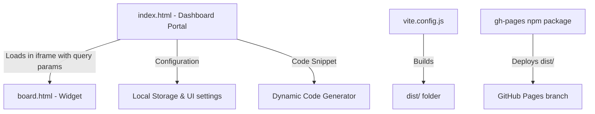

# Implementation Plan - Bulletin Board Integration & Test Dashboard

This project is a bulletin board testing suite integrated with the Artractive API and configured for deployment to GitHub Pages (gh-pages) at `git@github.com:tramper2/BulletinBD.git`.

Instead of just deploying a single static page, we will build an **ultra-premium Board Testing Dashboard** that allows:
1. Selecting and testing multiple board categories (e.g. Notice, Gallery, Q&A) by switching the `board_slug` dynamically.
2. Configuring custom API keys and board slugs on the fly via a settings panel (persisted in local storage).
3. A copy-paste code generator that displays the exact HTML/JS snippet needed to integrate the selected board on external sites.
4. Smooth glassmorphic design with neon glowing borders, active indicators, and micro-animations.

---

## Proposed Changes

We will initialize a Node.js project using Vite to serve the files locally and handle the multi-page builds for GitHub Pages.

### Component Structure

### Files to Create

#### [package.json](file:////wsl.localhost/Ubuntu/home/tramp/projects/webpage/BulletinBD/package.json)
Contains project metadata, scripts for running the development server (`dev`), building the project (`build`), and deploying to GitHub Pages (`deploy`), along with dependencies: `vite` and `gh-pages`.

#### [vite.config.js](file:////wsl.localhost/Ubuntu/home/tramp/projects/webpage/BulletinBD/vite.config.js)
Vite configuration file. It will configure:
- `base: '/BulletinBD/'` (required for GitHub Pages project path mapping).
- Multi-page input settings (compiling both `index.html` and `board.html`).

#### [.gitignore](file:////wsl.localhost/Ubuntu/home/tramp/projects/webpage/BulletinBD/.gitignore)
Ignores `node_modules/`, `dist/`, and local temporary files.

#### [index.html](file:////wsl.localhost/Ubuntu/home/tramp/projects/webpage/BulletinBD/index.html)
The dashboard main page. It includes:
- A responsive layout with a dashboard title, current configuration summary, and active board selection tabs.
- A sliding/collapsible settings panel to update the API Key and Custom Slug.
- An integration helper tab with a syntax-highlighted code block that updates in real-time.
- An `<iframe>` container that loads `board.html` dynamically by appending `?key=...&slug=...` to the URL.
- Premium styling: HSL tailored colors, dark mode, violet glowing gradients, backdrop filters, and subtle animations.

- Require an API Key to be configured in the parent dashboard, parsing query parameters `?key=...` and `?slug=...` dynamically.
- Hardcode the correct `SERVER_URL` to `'https://apiservice.artractive.pe.kr'` instead of `window.location.origin`.

---

## Verification Plan

### Automated/Local Verification
- Initialize git and link the remote `git@github.com:tramper2/BulletinBD.git`.
- Install dependencies with `npm install`.
- Run the local development server using `npm run dev` and test switching boards, writing posts, uploading files, and deleting posts.
- Run `npm run build` to verify the build output in `dist/` contains both `index.html` and `board.html` with correct relative path resolution.

### Manual Verification
- Deploy to GitHub Pages using `npm run deploy`.
- Access `https://tramper2.github.io/BulletinBD/` and verify that the dashboard and embedded boards load correctly.
